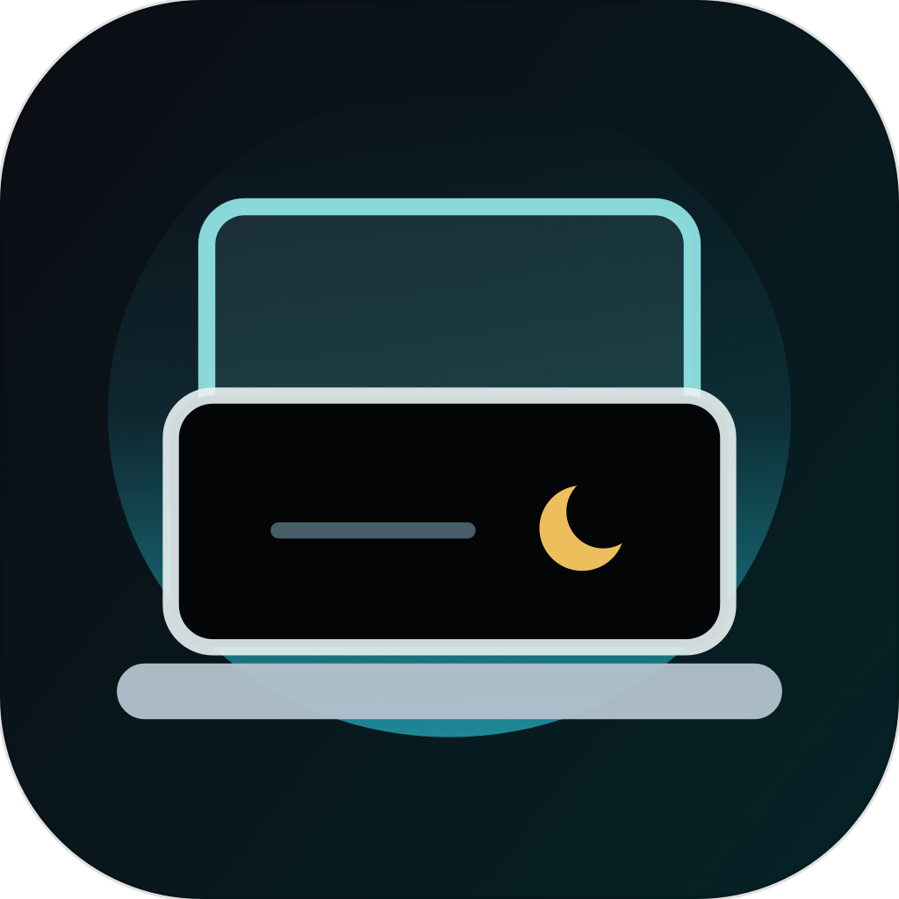

# Lidless

[English](README.md) | **Русский**

Утилита в строке меню macOS для работы MacBook с открытой крышкой и внешним монитором. Когда подключён физический внешний монитор, Lidless выключает встроенный экран на уровне раскладки дисплеев WindowServer. Клавиатура, трекпад, динамики и внешний монитор при этом продолжают работать. Приложение работает локально.

**[Скачать для macOS](https://github.com/Zireael-web/lidless/releases/latest)** (Apple Silicon, macOS 13+)

Мой pet-проект для собственного MacBook: здесь пробую нативную разработку под macOS на Swift.

[Управление](#управление) · [Безопасность](#безопасность) · [Сборка](#сборка) · [Установка](#установка) · [Восстановление](#если-встроенный-экран-не-включился) · [Ограничения](#известные-ограничения)

**Swift · AppKit · SwiftUI · macOS 13+ · Apple Silicon**

## Предупреждение

Приложение использует недокументированные приватные API macOS для управления дисплеями. Оно несовместимо с App Store и может перестать работать после обновления macOS. Предназначено только для личного локального использования.

## Управление

- `Turn Off Built-in Now` — сразу выключает встроенный экран, если доступен активный физический внешний монитор.
- `Restore` — включает встроенный экран обратно.
- `Restore & Pause App` — включает встроенный экран, выключает автоматический режим и оставляет приложение неактивным в строке меню.
- `Resume Auto Mode` — снова включает автоматическое отключение встроенного экрана.
- `Quit & Restore` — включает встроенный экран и завершает приложение.
- `Copy Diagnostics` — копирует в буфер обмена диагностику приватных API, дисплеев и сохранённого состояния.

## Горячие клавиши

```text
Ctrl + Cmd + D         Переключить встроенный экран
Ctrl + Opt + Cmd + R   Restore & Pause App
```

## Безопасность

- Встроенный экран выключается, только если обнаружен активный физический внешний монитор.
- В автоматическом режиме встроенный экран выключается, когда внешний монитор обнаружен и его состояние стабилизировалось.
- При отключении внешнего монитора встроенный экран включается обратно.
- При выходе из приложения встроенный экран восстанавливается.
- Если предыдущий запуск завершился сбоем или осталась устаревшая «аренда» выключенного экрана, при старте экран восстанавливается.
- Сторожевой процесс включает встроенный экран, если основное приложение завершилось, пока экран был выключен.
- AirPlay, Sidecar, DisplayLink, заглушки и виртуальные дисплеи по умолчанию не считаются доверенными.

## Сборка

Нужны Mac на Apple Silicon и Xcode Command Line Tools. В корне репозитория выполните:

```sh
./build.sh
```

Результат сборки:

```text
build/Lidless.app
dist/Lidless.app.zip
dist/Lidless.pkg      (если доступен pkgbuild)
```

Во время сборки `tools/generate_icons.swift` заново рисует иконку приложения и варианты в `design/icon-variants/`.

## Установка

```sh
./install.sh
```

Скрипт собирает приложение, копирует его в `/Applications/Lidless.app` и запускает. При первом запуске приложение регистрирует себя и сторожевой процесс как пользовательские LaunchAgents, чтобы Lidless запускался после входа в систему.

Скопировать приложение в `/Applications` без запуска:

```sh
./install.sh --no-launch
```

## Если встроенный экран не включился

1. Отключите кабель внешнего монитора: Lidless должен включить встроенный экран.
2. Снова откройте Lidless: при запуске он попробует восстановить встроенный экран.
3. Если WindowServer завис, перезагрузите Mac.

Некоторые мониторы и док-станции продолжают сообщать о подключённом дисплее, даже когда панель выключена. Тогда macOS считает внешний дисплей активным, и Lidless не может надёжно понять, что монитор не виден.

## Приватные API

Загружаются во время работы через `dlopen`/`dlsym`:

```text
SLSConfigureDisplayEnabled
CGSConfigureDisplayEnabled
```

Lidless не линкуется с приватными фреймворками напрямую и по умолчанию применяет конфигурацию дисплеев `.forSession`.

В macOS 26.5.1 старые транзакции `CGDisplayConfigRef` могут возвращать `CGError 1001` на вызовы включения, которые ничего не меняют. Поэтому Lidless сначала использует соответствующую приватную транзакцию SkyLight и считает `1001` успехом, только если дисплей уже в нужном состоянии.

## Известные ограничения

- Сочетание `Ctrl + Cmd + D` конфликтует с системным сочетанием macOS для поиска слова в словаре. Если поиск в словаре перестал работать, измените или отключите одно из сочетаний.
- Доверенные дисплеи определяются по названию. AirPlay-дисплей называется по имени устройства-приёмника (например, модели телевизора), а локализованные названия могут не содержать отфильтрованных фрагментов. Поэтому такой дисплей может ошибочно считаться физическим монитором.
- Сборка поддерживает только Apple Silicon (`arm64`).

## Структура проекта

```text
Lidless/
├── Lidless/
│   ├── App/                 Точка входа и AppDelegate
│   ├── Core/Display/        Состояние дисплеев, супервизор и мост к приватным API
│   ├── Core/Hotkeys/        Глобальные горячие клавиши
│   ├── Integrations/        LaunchAgents для автозапуска
│   ├── Persistence/         Сохранение состояния между запусками
│   ├── UI/MenuBar/          Значок в строке меню и панель управления
│   └── Info.plist
├── LidlessWatchdog/         Сторожевой процесс
├── tools/generate_icons.swift
├── design/icon-variants/    Варианты иконки
├── build.sh
└── install.sh
```

## Лицензия

[MIT](LICENSE)
